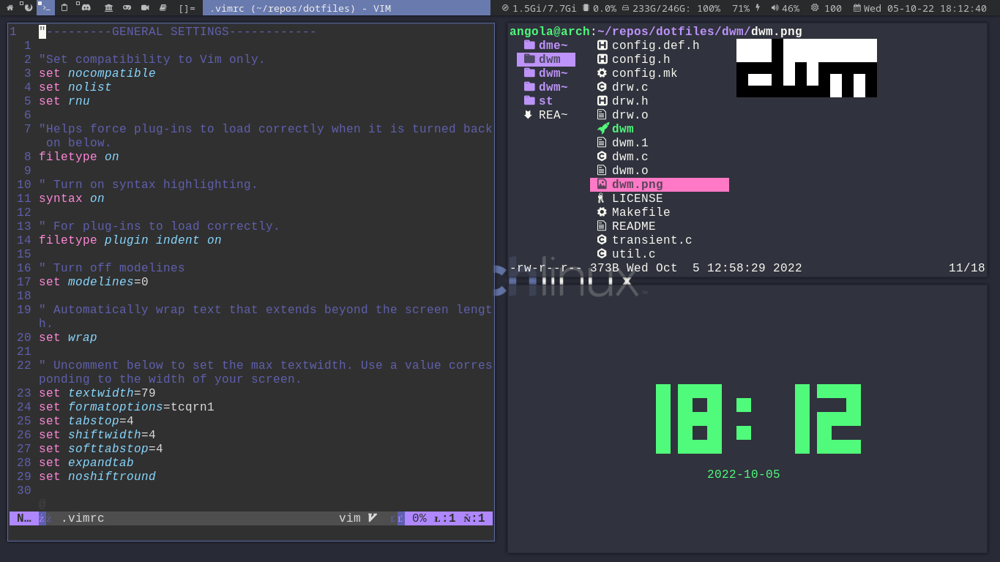
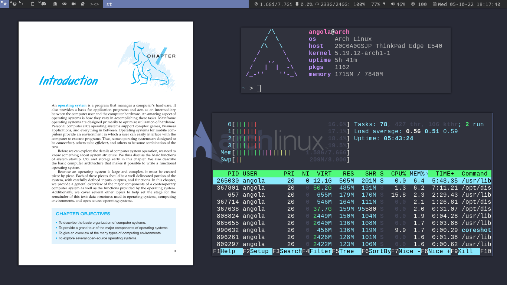

# My personal dotfiles and other configs

These are configuration files I use in my Arch Linux system for some of my most
used pieces of software.

* Settings for:
    * vim (text editor)
    * bash (shell)
    * lf (file manager)
    * mpv (video player)
    * dunst (notification daemon)
    * others
* Custom builds for [suckless](suckless.org) programs:
    * dwm (window manager)
    * st (terminal)
    * dmenu (application launcher)

## Screenshots

*vim, lf, tty-clock*

*zathura, pfetch, htop*

